# WorkLog 系統設計書

> 產生日期: 2026-02-08

## 目錄
- **專案概述**
- **技術選型與架構**
- **重要檔案與位置**
- **授權與安全**
- **API 端點（詳細）**
- **資料庫 ERD（Mermaid）**
- **部署與開發指南**

---

## 專案概述

- 名稱: WorkLog — 每日工作紀錄管理系統
- 目的: 提供使用者記錄工作內容、工時、專案、待辦事項並支援匯入/匯出
- 關鍵特性: 使用者與角色管理、WorkLog 記錄、多對多部門/工作類型標註、Todo 功能、資料匯入/匯出、JWT 認證

## 技術選型與架構

- 平台: .NET (ASP.NET Core)
- ORM: Entity Framework Core (SQL Server)
- 認證: JWT (對稱金鑰)
- 文件: Swagger / OpenAPI
- 前端: Blazor (`src/WorkLog.Web`)
- 架構: 分層架構 — API / Domain / Infrastructure / Web

## 重要檔案與位置

- 啟動: [src/WorkLog.Api/Program.cs](src/WorkLog.Api/Program.cs)
- 資料庫上下文: [src/WorkLog.Infrastructure/Data/AppDbContext.cs](src/WorkLog.Infrastructure/Data/AppDbContext.cs)
- Controllers: `src/WorkLog.Api/Controllers`（主要負責 API 路由與商業邏輯協調）
- Domain Entities: `src/WorkLog.Domain/Entities`
- Infrastructure (Repositories/Services): `src/WorkLog.Infrastructure`
- 前端: `src/WorkLog.Web`

## 授權與安全

- 使用 JWT Bearer。設定來源為 `appsettings.json` / 環境變數（`Jwt:Secret`, `Jwt:Issuer`, `Jwt:Audience`）
- Refresh Token 儲存在資料庫 `RefreshTokens` 表
- Swagger 已支援 Bearer 驗證
- 部分管理 API 設定 `[Authorize(Roles = "Admin")]`

---

## API 端點（詳細）

說明格式: `HTTP 方法` `路由` — 授權要求 — 主要請求/回應摘要

### AuthController (`/api/auth`)

- POST `/api/auth/register` — 無需授權 — 註冊新使用者。Request: `RegisterRequest`；Response: `ApiResponse<UserInfo>`
- POST `/api/auth/login` — 無需授權 — 登入並取得 `AccessToken` / `RefreshToken`。Request: `LoginRequest`；Response: `AuthResponse`
- POST `/api/auth/refresh` — 無需授權 — 使用 refresh token 刷新 access token。Request: `RefreshTokenRequest`；Response: `AuthResponse`
- GET `/api/auth/me` — 需授權 — 取得目前使用者資訊。Response: `UserInfo`
- POST `/api/auth/generate-hash` — 無需授權（僅開發測試）— 回傳密碼 hash
- POST `/api/auth/update-admin-password` — 無需授權（僅開發測試）— 更新預設 admin 密碼

### LookupController (`/api/lookup`) — 需授權

- GET `/api/lookup/projects` — 取得啟用的專案列表。Response: `List<LookupItemDto>`
- GET `/api/lookup/departments` — 取得啟用的部門列表
- GET `/api/lookup/work-types` — 取得啟用的工作類型列表
- GET `/api/lookup/statuses` — 取得啟用的處理狀態列表

### DataExportController (`/api/dataexport`) — 需授權

- GET `/api/dataexport/export` — 匯出使用者資料為 ZIP（可帶 `startDate`, `endDate`, `includeAttachments`）
- POST `/api/dataexport/validate` — 驗證上傳的 ZIP 檔案格式（Request: IFormFile）
- POST `/api/dataexport/import` — 匯入資料（Request: IFormFile，最大 50 MB）
- GET `/api/dataexport/export-worklog` — 匯出工作紀錄（依日期範圍與附件選項）
- GET `/api/dataexport/export-system` — 需 Admin — 匯出系統參照資料
- POST `/api/dataexport/validate-worklog` — 驗證工作紀錄匯入檔案
- POST `/api/dataexport/import-worklog` — 匯入工作紀錄檔案（最大 50 MB）
- POST `/api/dataexport/validate-system` — Admin — 驗證系統管理資料匯入檔案
- POST `/api/dataexport/import-system` — Admin — 匯入系統管理資料（最大 10 MB）

### WorkLogsController (`/api/worklogs`) — 需授權

- GET `/api/worklogs` — 查詢工作紀錄（支援分頁與篩選）。Query: `WorkLogQueryDto`；Response: `PagedResponse<WorkLogResponse>`
- GET `/api/worklogs/{id}` — 取得單筆工作紀錄（需為該使用者）
- POST `/api/worklogs` — 新增工作紀錄。Request: `WorkLogRequest`（包含 `DepartmentIds`, `WorkTypeIds`）
- PUT `/api/worklogs/{id}` — 更新工作紀錄（需為該使用者）
- DELETE `/api/worklogs/{id}` — 刪除工作紀錄（需為該使用者）
- GET `/api/worklogs/export?year=&month=` — 匯出指定年月的工作紀錄為 Excel (.xlsx)

### TodosController (`/api/todos`) — 需授權

- GET `/api/todos` — 查詢待辦事項（分頁/篩選）。Response: `PagedResponse<TodoItemListResponse>`
- GET `/api/todos/{id}` — 取得單筆待辦（含明細）
- GET `/api/todos/dashboard` — 取得儀表板摘要（待辦數量、逾期等）
- POST `/api/todos` — 新增待辦。Request: `CreateTodoItemRequest`（含子任務）
- PUT `/api/todos/{id}` — 更新待辦（Request: `UpdateTodoItemRequest`）
- DELETE `/api/todos/{id}` — 刪除待辦

- 子任務:
  - POST `/api/todos/{todoId}/subtasks` — 新增子任務
  - PUT `/api/todos/{todoId}/subtasks/{id}` — 更新子任務
  - DELETE `/api/todos/{todoId}/subtasks/{id}` — 刪除子任務

- 附件:
  - POST `/api/todos/{todoId}/attachments` — 上傳附件（Request 包含 `FileData`）
  - GET `/api/todos/{todoId}/attachments/{id}/download` — 下載附件
  - DELETE `/api/todos/{todoId}/attachments/{id}` — 刪除附件

- 評論:
  - POST `/api/todos/{todoId}/comments` — 新增評論
  - PUT `/api/todos/{todoId}/comments/{id}` — 更新評論（限評論作者）
  - DELETE `/api/todos/{todoId}/comments/{id}` — 刪除評論（限評論作者）

### TodoCategoriesController (`/api/todocategories`) — 需 Admin

- GET `/api/todocategories` — 取得所有分類
- GET `/api/todocategories/{id}` — 取得單一分類
- POST `/api/todocategories` — 新增分類
- PUT `/api/todocategories/{id}` — 更新分類
- DELETE `/api/todocategories/{id}` — 刪除分類

### AdminController (`/api/admin`) — 需 Admin

- 使用者管理:
  - GET `/api/admin/users` — 列表使用者
  - POST `/api/admin/users` — 建立使用者
  - PUT `/api/admin/users/{id}/role` — 變更使用者角色
  - PUT `/api/admin/users/{id}/password` — 重設使用者密碼

- 參照資料維護 (`projects`, `departments`, `work-types`, `statuses`):
  - GET/POST/PUT/DELETE 分別對應列表、建立、更新、刪除

---

## 資料庫 ERD（Mermaid）

下方使用 Mermaid ERD 描述主要實體與關係，可在支援 Mermaid 的工具（如 VS Code Markdown Preview、Mermaid Live Editor）中渲染。

```mermaid
erDiagram
    USER ||--o{ WORKLOG_ENTRY : has
    USER ||--o{ REFRESH_TOKEN : issues

    WORKLOG_ENTRY }o--|| PROJECT : belongs_to
    WORKLOG_ENTRY }o--|| PROCESS_STATUS : has_status

    WORKLOG_ENTRY ||--o{ WORKLOG_DEPARTMENT : uses
    DEPARTMENT ||--o{ WORKLOG_DEPARTMENT : contains

    WORKLOG_ENTRY ||--o{ WORKLOG_WORKTYPE : uses
    WORKTYPE ||--o{ WORKLOG_WORKTYPE : contains

    TODO_CATEGORY ||--o{ TODO_ITEM : contains
    TODO_ITEM ||--o{ TODO_SUBTASK : has
    TODO_ITEM ||--o{ TODO_ATTACHMENT : has
    TODO_ITEM ||--o{ TODO_COMMENT : has

    USER ||--o{ TODO_COMMENT : writes

    %% 欄位範例（重要欄位）
    USER {
      int Id
      string Username
      string Email
      string PasswordHash
      string Role
    }

    WORKLOG_ENTRY {
      int Id
      string Title
      string Content
      date RecordDate
      decimal WorkHours
      int UserId
      int? ProjectId
      int? ProcessStatusId
    }

    PROJECT {
      int Id
      string Name
    }

    DEPARTMENT {
      int Id
      string Name
    }

    WORKTYPE {
      int Id
      string Name
    }

    TODO_ITEM {
      int Id
      string Title
      string Description
      date? DueDate
      string Status
      string Priority
      int? CategoryId
      int UserId
    }

    TODO_SUBTASK {
      int Id
      int TodoItemId
      string Title
      bool IsCompleted
    }

    TODO_ATTACHMENT {
      int Id
      int TodoItemId
      string FileName
    }

    TODO_COMMENT {
      int Id
      int TodoItemId
      int UserId
      string Content
    }

    REFRESH_TOKEN {
      int Id
      int UserId
      string Token
      datetime ExpiresAt
    }
```

---

## 部署與開發指南（快速）

- 本機啟動 API:

```powershell
cd src\WorkLog.Api
dotnet run
```

- 或使用 workspace task `Start API`（task 列表內已定義）
- 資料庫遷移: 程式啟動時自動執行 `db.Database.Migrate()`；若需手動建立 migration，可使用 workspace 提供的 `EF Core Migration` 或 `Recreate Migration` task
- 注意: 生產環境請將 `Jwt:Secret` 與連線字串儲存在秘密管理（Key Vault / 環境變數）

---

## ERD 圖檔

ERD 已產生並存放於 `docs/erd.svg`（SVG）。下方為嵌入圖示預覽：



若要我把此檔案轉成 PDF、或將 API 端點自動輸出為 Postman / OpenAPI JSON，我可以繼續處理。也可以把 ERD 轉為圖片並置入設計書，請告訴我下一步偏好。
